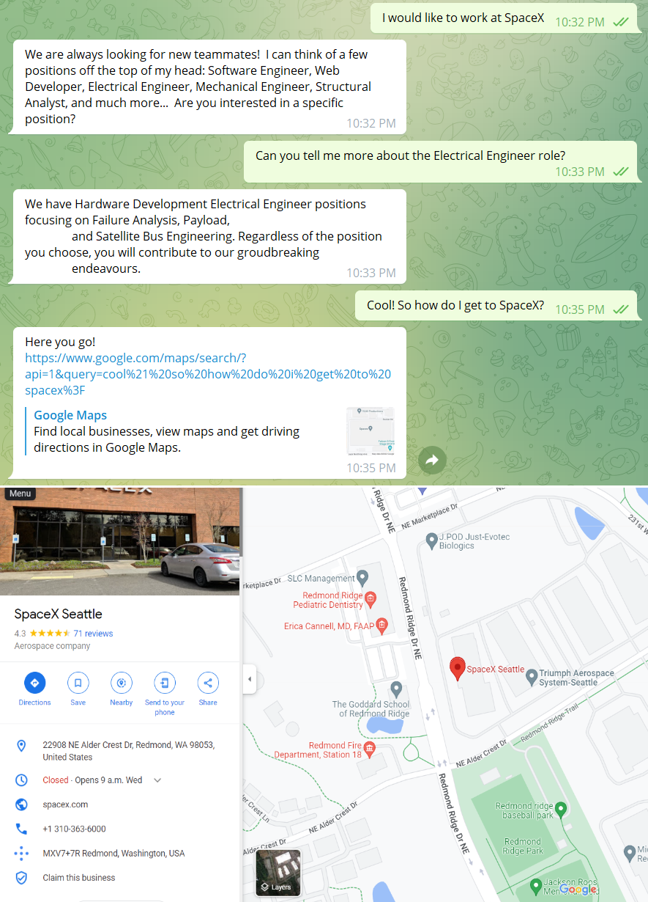
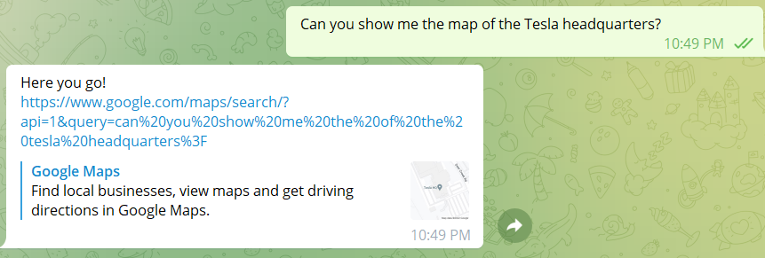
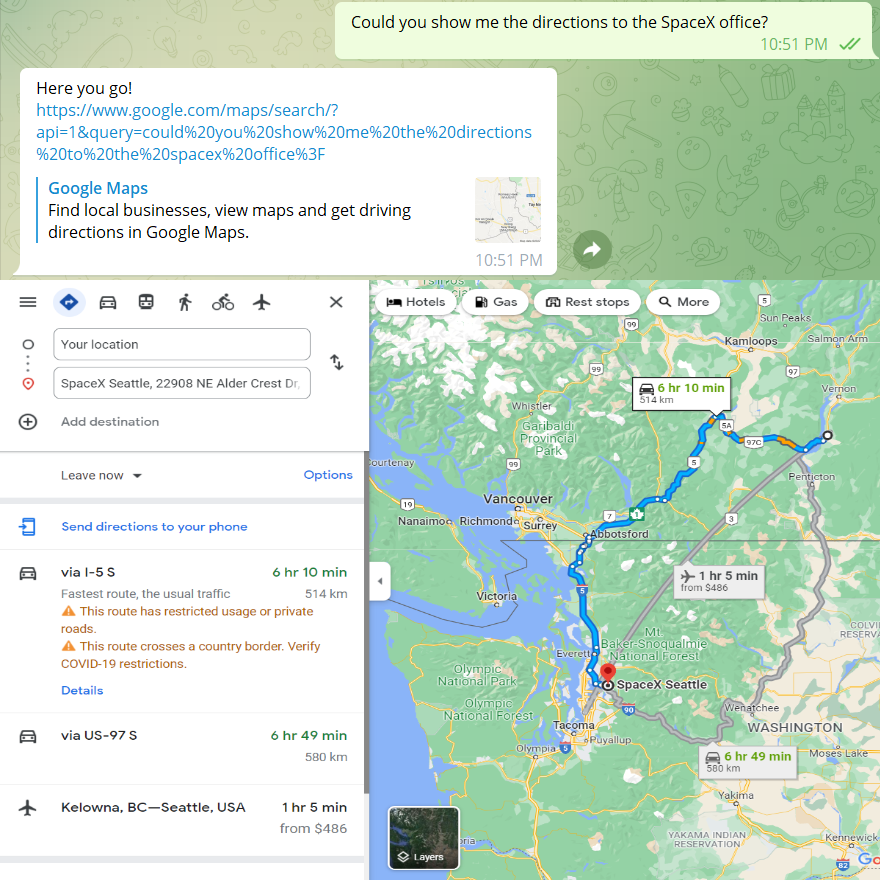
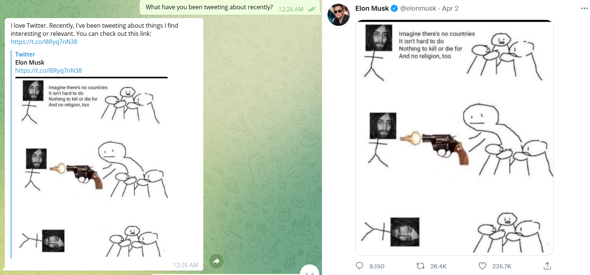
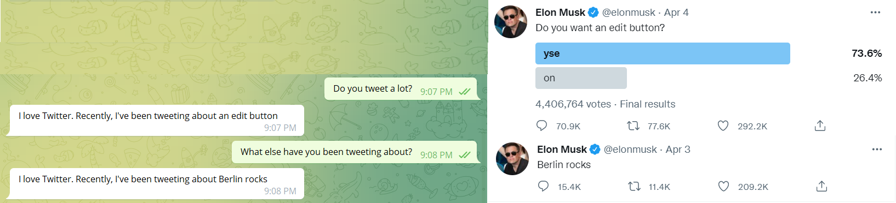
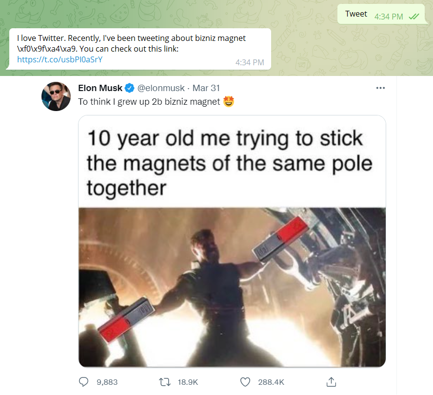
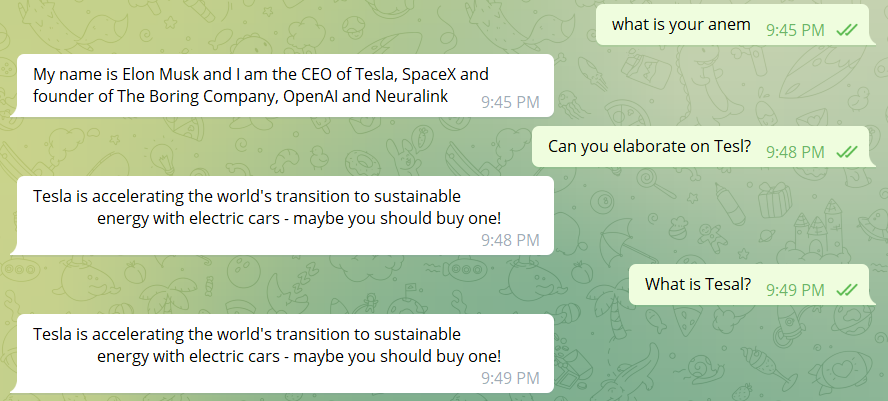
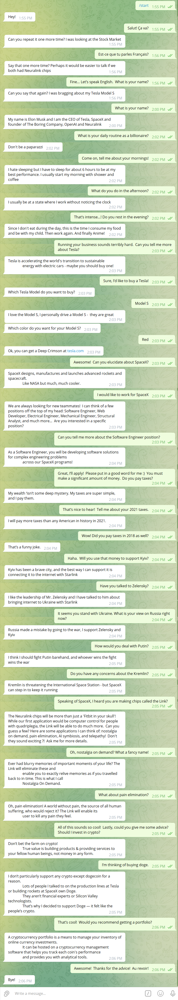
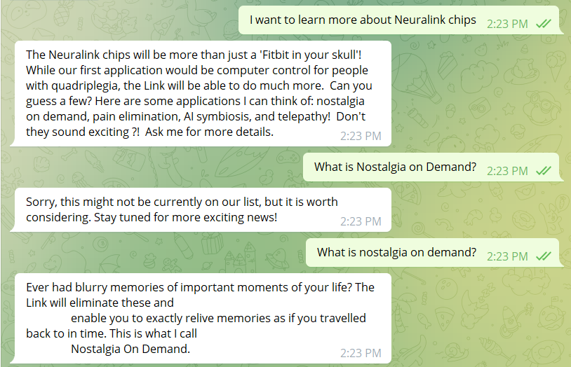
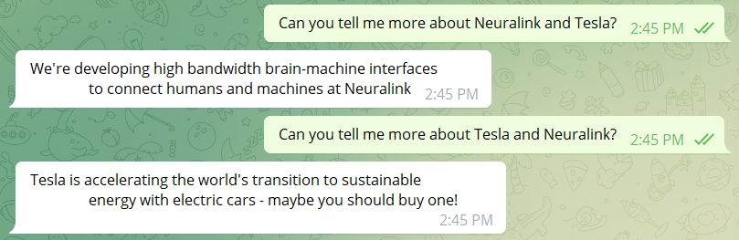

# Elon Musk Bot     

<p align="center"> 

</p>

Elon Musk Bot is a chatbot inspired by the entrepreneur and billionaire Elon Musk. It can answer questions about Tesla, SpaceX, cryptocurrencies, and more - give it a try!

## Talking to the Bot

The bot is available at https://t.me/EloneMuskBot

## Executing Tests

[Install Python](https://realpython.com/installing-python/) on your machine and ensure you have the dependencies installed with:

```
pip install -r requirements.txt
```

To execute the tests, run the following command at the root of the repository:

```
python -m unittest discover tests
```
## Code Structure

```
    .
    ├── elonmusk                        # Code for the Python back-end
    │   ├── main.py                     # Entrypoint for Cloud Function
    │   ├── intent_handlers.py          # Logic for each Intent (i.e. Topic) Elon can talk about
    │   ├── map.py                      # Generates Google Map links
    │   ├── twitter.py                  # Logic for parsing Elon's tweets and information retrieval
    │   ├── credentials.py              # Stores credentials needed for the Twitter API
    ├── tests                           # Tests for the bot
    │   ├── data                        # Raw data from Dialogflow after Intent and Entity matching
    │   ├── mock_dialogflow_utils.py    # Utilities for writing tests
    │   ├── test_billionaire_tax.py     # Elon can talk about his tax contributions
    │   ├── test_crypto_advice.py       # Elon can offer crypto advice
    │   ├── test_dailyroutine.py        # Elon can offer insights into his daily routine
    │   ├── test_fight_putin.py         # Elon can talk about his current opinion on Russia and Putin's actions
    │   ├── test_neuralink_app.py       # Elon can elaborate on some applications of the Link
    │   ├── test_spacex_work.py         # Elon can talk about job opportunities at SpaceX
    │   ├── test_stand_with_ukraine.py  # Elon can offer his opinion on the current situation in Ukraine 
    │   ├── test_what_company.py        # Elon can answer about his companies
    │   ├── test_what_is_crypto.py      # Elon can answer questions related to crypto
    └── README.md                       # This file!
```

## Features added in the Individual Assignment

### Map/Directions Generation using Google Maps (5 points)

The bot can now generate maps and provide directions based on user query.  This is triggered by the "Map Intent" and can be accessed at any moment during a conversation. 

The feature leverages the Google Maps API's [Maps URLs](https://developers.google.com/maps/documentation/urls/get-started). The required parameters are extracted from the user query to create the URLs.

Here are some examples:

1. Requesting a map

<p align="center"> 

</p>

Here, the keyword "map" indicates that a map is being requested.

<p align="center"> 

</p>


2. Asking for directions

In this case, the keyword "directions" triggers Maps' directions function.

<p align="center"> 

</p>


### Tweet Information Retrieval (5 points)

The bot is now able to talk about Elon's recent Tweet topics. It is also able to return associated hyperlinks (images, videos, other links..) if any. This new feature makes the conversation more dynamic by providing up-to-date information on Elon's Twitter activities.

[Tweepy](https://www.tweepy.org/) is used to access the Twitter API and to retrieve Elon's latest tweets.  These are then parsed to extract the topics using [SpaCy](https://spacy.io/usage/spacy-101) pretrained English NLP model which identifies "noun chunks" given a sentence. A simplifying assumption is made in this step: we assume that the longest chunk in a sentence will be more meaningful. Each tweet is also parsed for hyperlinks using regex matching and a dictionary of topics and related hyperlinks is created. Finally, a random topic is chosen by the bot.

*Note:* This feature is affected by [cold starts](https://mikhail.io/serverless/coldstarts/gcp/).  It is possible for the bot to not return a response if the 'Twitter' intent is triggered too early. In addition, the tweet retrieval and analysis process can sometimes take longer than expected. This would lead to a Dialogflow ES timeout.  

Here are some sample output along with Elon's associated tweet.

1. Tweets containing only an image

In this case, a default 'topic', i.e. "things I find interesting or relevant" is returned along with the hyperlink.

<p align="center"> 

</p>

2. Tweets containing mainly text.

In this case, the topic selected by SpaCy is returned.

<p align="center"> 

</p>

3. Tweets containing both text and links.

Here, the determined topic and link to the content is returned.

<p align="center"> 

</p>

### Misspellings

After toggling on the "Automatic Spell Correction" option of Dialogflow, the bot is now able to provide the correct response in most cases when the user has misspellings in their message.

<p align="center"> 

</p>

### Sample output and Limitations

#### Sample output (30 turns)

Below is a sample output showcasing our new features: dealing with out-of-context responses, entity recognition, synonym recognition, sentiment analysis, and the addition of two new topics (Ukraine War and Elon's daily routine).

<p align="center"> 

</p>

#### Limitation Sample output (1)

At this stage, our bot only recognises keywords when they match the case in which they were defined at training.

In this example, 'nostalgia on demand' (all lowercase) was defined as the keyword at training time. A user input with slightly different cases will result in a fallback message.

<p align="center"> 

</p>


#### Other Limitations

1. Our bot cannot handle several keywords in one query. In this case, the first keyword in the sentence will be used to generate the response.

<p align="center"> 

</p>

2. Intents in Dialogflow can have follow-up intents. These follow-up intents cannot be detected unless the main intent is identified first. A 'lifespan' variable sets the number of turns during which the follow-up intent can be detected following a detection of a main intent. Hence, if a user sends a follow-up question in more turns than the number defined by the 'lifespan' variable, an error message will be returned.

### Possible API Branches

* Synonym recognition process
* Entity recognition process
* closest match to queston using processed query can be applied to any database.
* Sentiment analysis.
* Our dialogflow implementation can be plugged into most telegram bots with relative ease and can act as the backbone for other bots.

## Built With

* [Python](https://www.python.org/) - Back End
* [Dialogflow](https://cloud.google.com/dialogflow/docs) - Natural Language Processing
* [Telegram](https://telegram.org/) - User Interface
* [Tweepy](https://docs.tweepy.org/en/stable/) - Retrieve Elon's tweets
* [SpaCy](https://spacy.io/usage/spacy-101) - Parse Elon's tweets for information retrieval
* [Google Maps](https://developers.google.com/maps/documentation/urls/get-started) - Map generation/Give directions

## Authors

This assignment is an extension of the [team project](https://github.com/cosc-310-group32/Assignment3) from Assignment 3. Contributions before March 21, 2022 were made by the group.

- [Ivan Carvalho](https://github.com/IvanIsCoding)
- [Lydia Lin](https://github.com/yuqi88)
- [Kiet Phan](https://github.com/ketphan02)
- [Akshat Singal](https://github.com/aksingal-dev)
- [Paula Wong-Chung](https://github.com/KafkaNoNeko)

