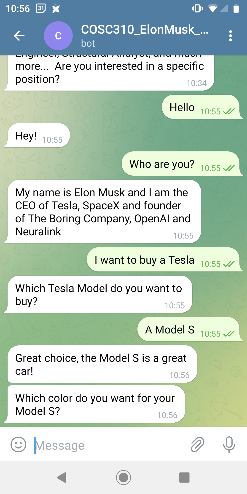
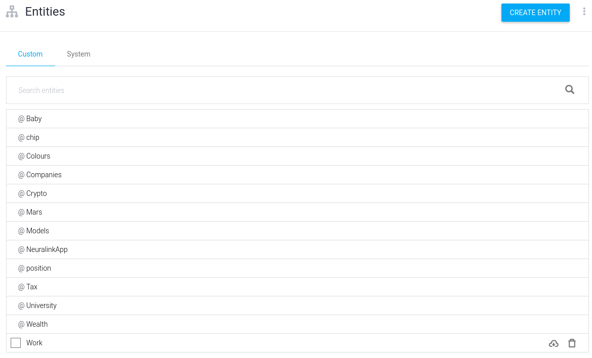
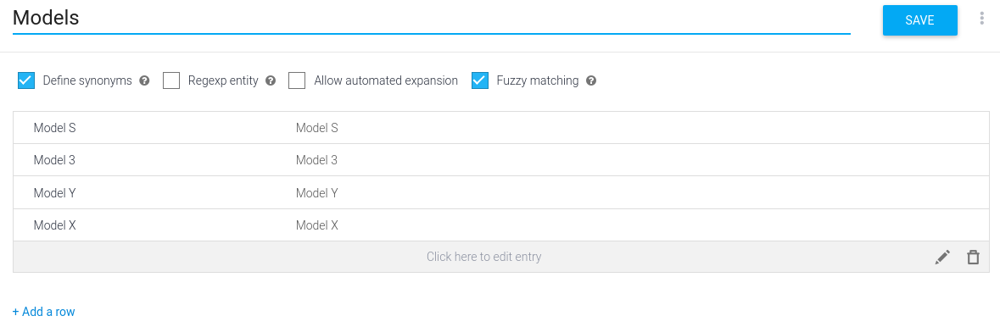
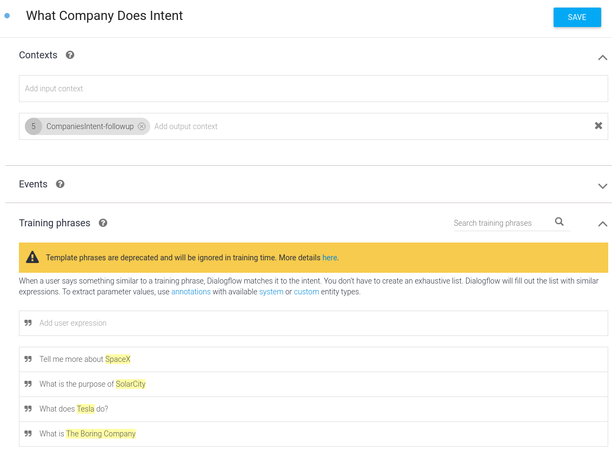
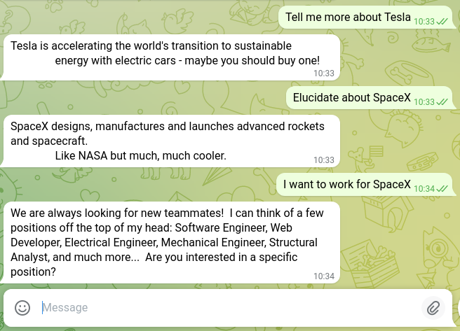
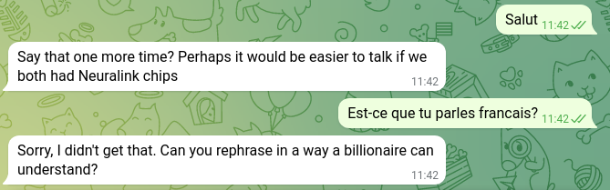
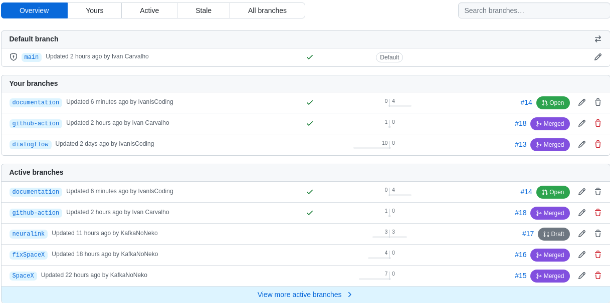
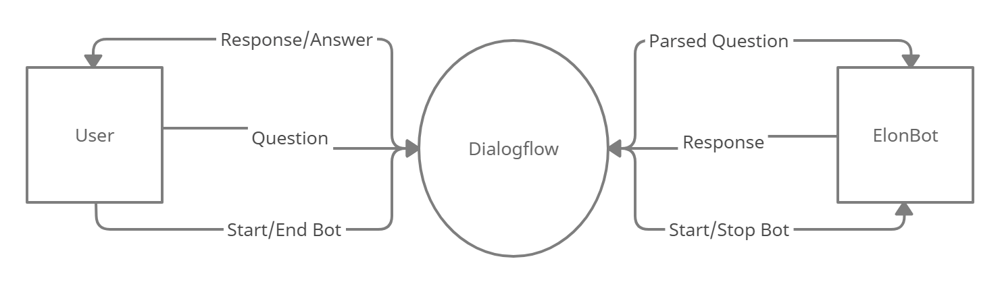
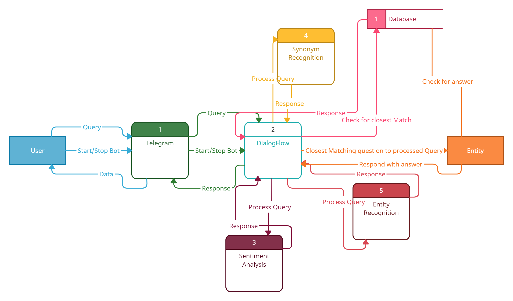

# Elon Musk Bot   

<p align="center"> 

</p>

Elon Musk Bot is a chatbot inspired by the entrepreneur and billionaire Elon Musk. It can answer questions about Tesla, SpaceX, cryptocurrencies - give it a try!

## Talking to the Bot

The bot is available at https://t.me/COSC310_ElonMusk_Dialogflow_bot

## Executing Tests

[Install Python](https://realpython.com/installing-python/) on your machine and ensure you have the dependencies installed with:

```
pip install -r requirements.txt
```

To execute the tests, run the following command at the root of the repository:

```
python -m unittest discover tests
```
## Code Structure

```
    .
    ├── elonmusk                      # Code for the Python back-end
    │   ├── main.py                   # Entrypoint for Cloud Function
    │   ├── intent_handlers.py        # Logic for each Intent (i.e. Topic) Elon can talk about
    ├── tests                         # Tests for the bot
    │   ├── data                      # Raw data from Dialogflow after Intent and Entity matching
    │   ├── test_what_company.py      # Elon can answer about his companies
    │   ├── mock_dialogflow_utils.py  # Utilities for writing tests
    └── README.md                     # This file!
```

## Features added in Assignment 3

### GUI Improvements (1 point)

We use Telegram's user interface as a way of giving a face to our bot. By incorporating the already popular and polished platform were able to vastly improve on the GUI. 

The bot is available at https://t.me/COSC310_ElonMusk_Dialogflow_bot, and users can talk to the bot in any platform that Telegram 
is supported. For example, on Android the interface looks like:

<p align="center"> 

</p>

### Improvements using language toolkits

#### Entity analysis (2 points)

By enabling the bot to pick out proper nouns used in the conversation we are able to improve the accuracy of the bot's responses by guaging the topic of conversation quicker than earlier. Thereby we save the user fom having to repeat themselves and improve their overall experience. as seen below, the bot is able to understand Tesla and Model S as entities.
    <p align="center"> 
    
    </p>

To detect entities, we manually defined the entity types of our training set in Dialogflow:

<p align="center"> 

</p>

Inside each entity we defined, we provided the items we want to detect. For example, to detect the models Tesla sells as 
seen in the previous chat, we created the "Models" entity:

<p align="center"> 

</p>

#### Sentiment analysis (2 points)

We are able to analyse to beyond just the individual words the user is saying with Dialogflow. That happens with Sentiment Analysis, which in Dialogflow is also called Intent Analysis.

In order for Dialogflow to do Sentiment Analysis, we provided it with training phrases. For example, to talk about companies we
provide Dialogflow with sentences such as "Tell me more about SpaceX" and annotate that SpaceX is an entity of the type "Company".

<p align="center"> 

</p>

If we provide enough training sentences, Dialogflow detects the sentiment correctly. We reinforce that the training set does not need to be extensive to detect the sentiment, take for example the following conversation:

<p align="center"> 

</p>

Dialogflow can answer about Tesla even though the training sentence is "Tell me more about SpaceX". It can also generalize 
sentiment analysis to words it has never seen. "Elucidate" never appeared on the training set, and our bot still answered the question
correctly. Lastly, Sentinment Analysis is not based only on Entity Analysis: if we ask "I want to work at SpaceX", the bot detects
a different intent and talks about the positions available.

#### Synonym Recognition (2 points)

By being able to recognize common synonyms used by the user, the bot is a able to respond to a wider amount of inpputs and the user experiecne is enriched as they get a greater freedom when it comes to choosing how they phrase their question. This allows them to have a more natural conversation with the bot. as seen below, we are able to use red in place of crimson and the bot can still provide an accurate answer
    <p align="center"> 
    
    </p>

### Extra topics (0.5 points)

We have expanded the topics Elon Musk bot can talk about. The current list is:

* Crypto
* Billionaire Tax
* Tesla
* SpaceX
* Neuralink
* Ukraine War **(new topic)**
* Anime **(new topic)**

### Out of Scope Responses (0.5 points)

We created an Out of Scope intent in Dialogflow. When Sentiment Analysis cannot match a sentence to an existing intent, we send one predefined responses using Elon's sarcasm. Take a look at the example chat where we greet Elon in French and ask if he speaks French:

<p align="center"> 

</p>


### Github Repo with commit history

Link to repo: https://github.com/cosc-310-group32/Assignment3/tree/main .
The branch structure **as of 2022-03-17** can be found below. Each branch maps to one Pull Request, with `main` as the branch with working code.
<p align="center"> 

</p>

### Level 0 data flow diagram

The Level 0 diagram can be found below:
<p align="center"> 

</p>

Explaination: When the user first connects to the bot they send a message to dialogflow which passes it on to the bot to start the session. Every question asked by the user is analysed by dialogflow and then parsed to the bot once it has been converted to it's closest match on the database. The bot then returns the result based on the closest match and that result is sent over to the user through dialogflow.  

### Level 1 data flow diagram

The level 1 dataflow diagram can be found below:
<p align="center"> 

</p>

Explaination: When the user connects to dialogflow using telegram, they send a start bot message that is passed on to the bot to start the session as a closest matched question. Every subsiquent query is analysed for synonyms, sentiment and entities while beong processed and dialogflow finds the closest match to the processed query from the database of information that is available to the bot. This question is then sent to the bot which then looks up the answer and responds with the answer to the question. This answer is, in turn, displayed to the user on the telegram GUI.

### Sample output and Limitations

**todo**

### Possible API Branches

* Synonym recognition process
* Entity recognition process
* closest match to queston using processed query can be applied to any database.
* Sentiment analysis.
* Our dialogflow impelemtation can be plugged into most telegram bots with relative ease and can act as the backbone for other bots.

## Built With

* [Python](https://www.python.org/) - Back End
* [Dialogflow](https://cloud.google.com/dialogflow/docs) - Natural Language Processing
* [Telegram](https://telegram.org/) - User Interface

## Authors

- [Kiet Phan](https://github.com/ketphan02)
- [Ivan Carvalho](https://github.com/IvanIsCoding)
- [Lydia Lin](https://github.com/yuqi88)
- [Akshat Singal](https://github.com/aksingal-dev)
- [Paula Wong-Chung](https://github.com/KafkaNoNeko)

